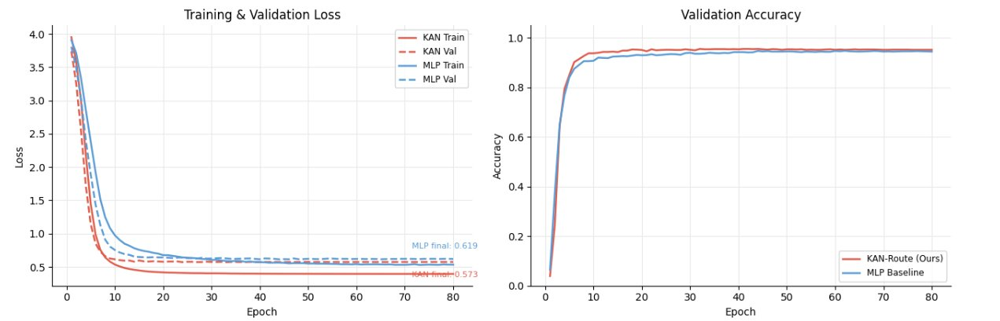
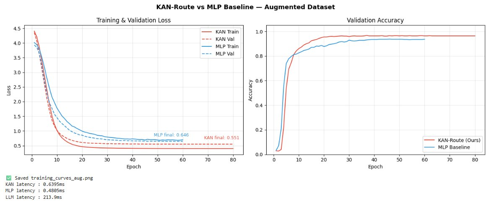
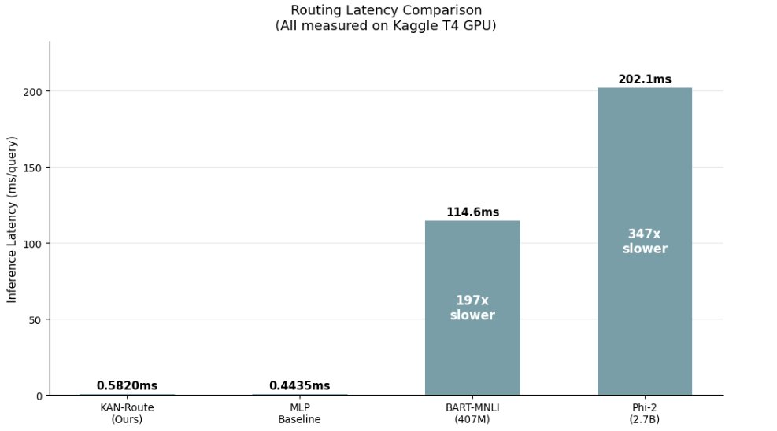
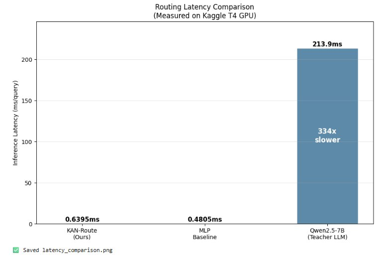
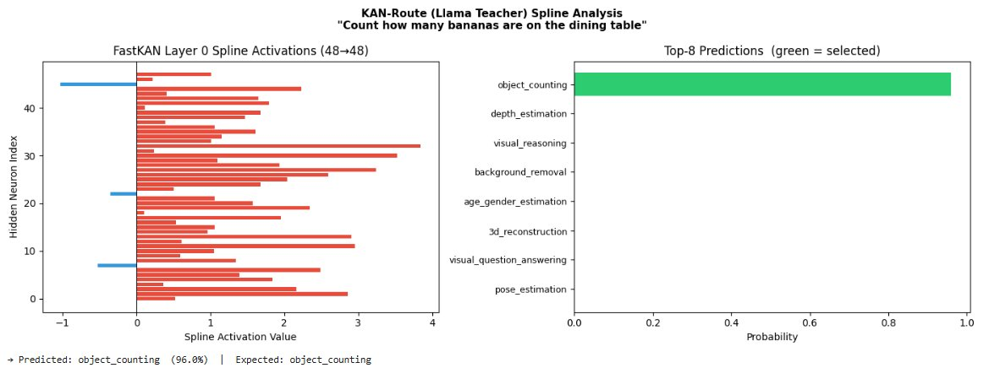
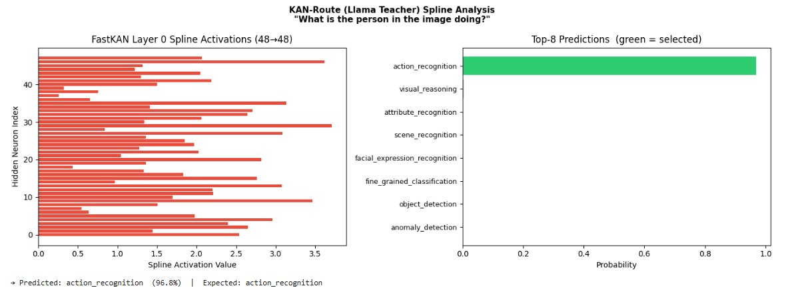
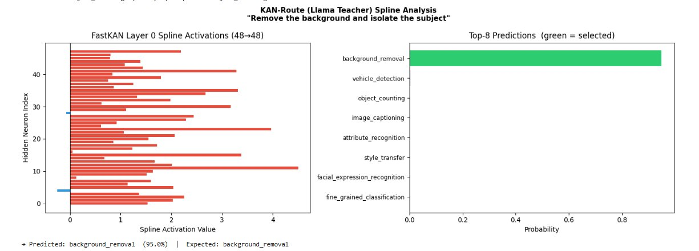
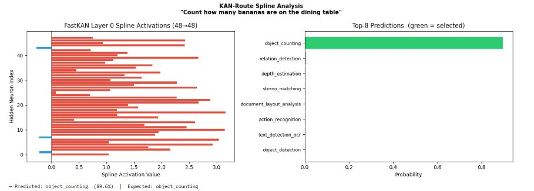
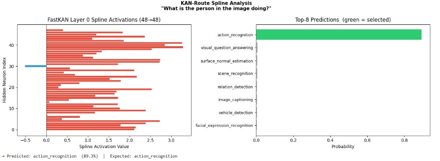
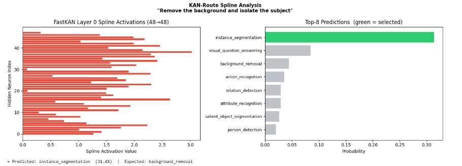

# KAN-Route: Parameter-Efficient Kolmogorov-Arnold Networks for Visual Agent Tool-Orchestration

[](https://www.python.org/)
[](https://pytorch.org/)
[](LICENSE)
[]()

KAN-Route is a lightweight, interpretable tool-orchestration framework for visual agent pipelines. It replaces billion-parameter LLM routers with a compact **Kolmogorov-Arnold Network (KAN)** operating over fused multimodal embeddings — achieving competitive accuracy at **300–1,400× lower latency** and **sub-100k parameters**.

> **Paper:** *KAN-Route: Parameter-Efficient Kolmogorov-Arnold Networks for Visual Agent Tool-Orchestration* (CVPR 2026)
>
> **Note:** This repository covers the open-weight teacher pipeline (Llama-3.1-8B and Qwen2.5-7B) and the full training/evaluation stack. The Gemini-2.5-Flash primary dataset pipeline is maintained by a collaborator and is available on request.

---

## Key results

**16-tool benchmark (Gemini-2.5-Flash dataset, 5,008 samples)**

| Model | Params | Top-1 | Top-3 | F1 Macro | Latency (ms) | Speedup |
|---|---|---|---|---|---|---|
| Kimi-K2 (zero-shot) | 1T | 98.40% | — | 0.8494 | 1,169.8 | — |
| Qwen3-32B (zero-shot) | 32B | 98.40% | — | 0.8502 | 1,085.3 | — |
| Llama-4-Maverick (zero-shot) | 400B | 95.60% | — | 0.9005 | 2,180.7 | — |
| MLP Baseline | 64,066 | **99.40%** | 100% | 0.9941 | 0.176 | — |
| **KAN-Route** | **63,840** | **99.00%** | **100%** | **0.9902** | **1.489** | **786×** |

**35-tool benchmark (open-weight teachers, Qwen+aug: 39,400 samples)**

| Model | Top-1 | Top-3 | F1 Macro | Latency (ms) | Speedup |
|---|---|---|---|---|---|
| Llama-3.1-8B (zero-shot) | — | — | — | 644.1 ± 6.6 | 1× |
| Qwen2.5-7B (zero-shot) | — | — | — | 213.9 ± 1.8 | 1× |
| MLP Baseline (Qwen+aug) | 95.69% | 99.06% | 0.8013 | 0.481 ± 0.027 | 445× |
| **KAN-Route FastKAN (Qwen+aug)** | **95.62%** | **98.79%** | **0.7972** | **0.640 ± 0.029** | **335×** |

---

## Architecture

KAN-Route operates in two stages:

```
User Query    ──► MiniLM-L6-v2 (frozen, 22.7M) ──► 384-dim ─┐
                                                               ├─► [896-dim] ──► KAN Router ──► Tool
Image context ──► CLIP ViT-B/32  (frozen)       ──► 512-dim ─┘
```

**Stage 1 — Frozen feature extraction.** A user query is encoded by `all-MiniLM-L6-v2` (384-dim). The image context, represented as a COCO object-label description, is encoded by CLIP ViT-B/32 (512-dim). The two embeddings are concatenated into a 896-dim fused vector.

**Stage 2 — KAN routing head.** The fused vector passes through a compact FastKAN with architecture `[896 → 48 → N]` (N = number of tools). Each edge learns a univariate RBF activation `φ(x)` that can be directly visualised per input dimension — a transparency property unavailable in MLP or LLM baselines.

---

## Repository structure

```
kan-route/
├── src/
│   ├── tools.py          # Tool taxonomy (50 tools, 8 macro-categories) + descriptions
│   ├── models.py         # KANRoute + MLPBaseline architectures
│   ├── dataset.py        # COCO grounding + LLM query synthesis (Llama / Qwen)
│   ├── embeddings.py     # MiniLM + CLIP embedding + fusion pipeline
│   ├── train.py          # Training loop — AdamW + OneCycleLR + label smoothing
│   ├── evaluate.py       # Top-1/3 accuracy, macro F1, CUDA latency benchmark
│   ├── augment.py        # Paraphrase augmentation (9,903 → 39,400 samples)
│   └── agent.py          # KANRouteAgent + ToolExecutionEngine (HF Inference API)
├── notebooks/
│   ├── 01_llama_pipeline.ipynb   # Llama-3.1-8B teacher pipeline (Kaggle T4)
│   └── 02_qwen_pipeline.ipynb    # Qwen2.5-7B teacher + paraphrase augmentation
├── scripts/
│   ├── plot_spline_activations.py  # Reproduce Figure 1 — spline activation curves
│   └── benchmark_latency.py        # Reproduce Table 1 latency numbers
├── configs/
│   └── default.yaml      # Hyperparameters and dataset paths
├── assets/               # Figures referenced in this README
├── requirements.txt
└── README.md
```

---

## Quickstart

### Installation

```bash
git clone https://github.com/<your-username>/kan-route.git
cd kan-route
pip install -r requirements.txt

# FastKAN must be installed from source
pip install git+https://github.com/ZiyaoLi/fast-kan.git
```

> Experiments were run on Kaggle (NVIDIA T4 GPU). Adjust `paths.annotations` and `paths.img_dir` in `configs/default.yaml` for local runs.

### Generate training data

The open-weight pipelines (your contribution) are fully self-contained in the notebooks:

```bash
# Qwen2.5-7B — recommended (includes paraphrase augmentation, 39,400 samples)
jupyter nbconvert --to notebook --execute notebooks/02_qwen_pipeline.ipynb

# Llama-3.1-8B — alternative teacher (9,903 samples, 35-tool taxonomy)
jupyter nbconvert --to notebook --execute notebooks/01_llama_pipeline.ipynb
```

Both notebooks require COCO 2017 Val annotations (`instances_val2017.json`). On Kaggle, use the `awsaf49/coco-2017-dataset` dataset.

### Train

```python
from src.models import KANRoute
from src.train import train_model
from src.embeddings import build_feature_matrix

X, y = build_feature_matrix("path/to/dataset.json")
model = KANRoute(input_dim=896, proj_dim=48, hidden_dims=[48], num_tools=50)
train_model(model, X, y, model_name="KAN_Route", is_kan=True)
```

### Inference

```python
from src.agent import KANRouteAgent
import torch

agent = KANRouteAgent(
    kan_model=model,
    sbert=sbert,
    clip_model=clip_model,
    clip_preprocess=clip_preprocess,
)

result = agent.run(
    query="How many people are in this image?",
    image_path="path/to/image.jpg",
    execute=False,   # set True to call HuggingFace Inference API
)
# → {'selected_tool': 'object_counting', 'confidence': 0.94, ...}
```

---

## Reproducing paper figures

**Figure 1 — Spline activation curves**

```bash
python scripts/plot_spline_activations.py \
    --checkpoint path/to/KAN_Route_best.pt \
    --embeddings  path/to/test_embeddings.npy \
    --labels      path/to/test_labels.npy \
    --out         assets/spline_activations.png
```

**Table 1 — Routing latency**

```bash
python scripts/benchmark_latency.py \
    --kan-checkpoint path/to/KAN_Route_best.pt \
    --mlp-checkpoint path/to/MLP_Baseline_best.pt \
    --num-tools 50
```

---

## Training dynamics

**Llama-3.1-8B conditioned (35-tool, 9,903 samples)**

KAN-Route converges slower than the MLP (~30 epochs vs ~10) but achieves a lower final training loss (0.573 vs 0.619).



**Qwen2.5-7B + paraphrase augmentation (35-tool, 39,400 samples)**

On the larger augmented corpus KAN-Route again reaches lower final loss (0.551 vs 0.646), with both models showing no overfitting.



## Latency

**Llama pipeline** — KAN-Route (0.58ms) and MLP Baseline (0.44ms) vs BART-MNLI and Phi-2:



**Qwen+aug pipeline** — KAN-Route (0.64ms) and MLP (0.48ms) vs Qwen2.5-7B teacher (213.9ms, 334× slower):



## Interpretability

A key advantage of KAN-Route over MLP and LLM baselines is **first-class routing interpretability** via learnable spline activations. The FastKAN Layer 0 activation plot shows per-hidden-neuron spline values for a given query; red bars are driven by MiniLM text dimensions, blue bars by CLIP visual dimensions.

### Llama pipeline — correct predictions

**"Count how many bananas are on the dining table"** → `object_counting` ✓ (96.0%)



**"What is the person in the image doing?"** → `action_recognition` ✓ (96.8%)



**"Remove the background and isolate the subject"** → `background_removal` ✓ (95.0%)



### Qwen+aug pipeline — correct predictions and a failure case

**"Count how many bananas are on the dining table"** → `object_counting` ✓ (89.6%)



**"What is the person in the image doing?"** → `action_recognition` ✓ (89.3%)



**"Remove the background and isolate the subject"** → `instance_segmentation` ✗ (31.4%, expected `background_removal`)

This is a characteristic failure mode: `background_removal` and `instance_segmentation` are semantically proximate — both involve isolating a foreground subject — and the model conflates them on ambiguous phrasing. The spline activation profile for this query shows no strong suppression of segmentation-class dimensions, consistent with the overlapping activation signatures discussed in Section 5.3 of the paper.



---

## Tool taxonomy

50 computer vision tools across 8 macro-categories. Some tools in the extended taxonomy had insufficient COCO-grounded training samples and were filtered during evaluation; the paper reports results on 16-tool and 35-tool subsets. See `src/tools.py` for the full list and `src/tools.py::TOOL_BATCHES` for the generation batching used in the LLM pipelines.

---

## Datasets and model weights

| Asset | Description | Availability |
|---|---|---|
| COCO 2017 Val | Visual grounding source | [cocodataset.org](https://cocodataset.org/) |
| Llama-conditioned corpus | 9,903 samples, 35-tool taxonomy | Available on request |
| Qwen+aug corpus | 39,400 samples with paraphrase augmentation | Available on request |
| `KAN_Route_best.pt` | Best checkpoint | Available on request |
| `MLP_Baseline_best.pt` | Parameter-matched MLP baseline | Available on request |

---

## Citation

```bibtex
@inproceedings{kanroute2026,
  title     = {KAN-Route: Parameter-Efficient Kolmogorov-Arnold Networks
               for Visual Agent Tool-Orchestration},
  booktitle = {Proceedings of the IEEE/CVF Conference on Computer Vision
               and Pattern Recognition (CVPR)},
  year      = {2026},
}
```

---

## Acknowledgements

- [Efficient-KAN](https://github.com/Blealtan/efficient-kan) by Blealtan
- [FastKAN](https://github.com/ZiyaoLi/fast-kan) by Ziyao Li
- [COCO 2017](https://cocodataset.org/) dataset
- [all-MiniLM-L6-v2](https://huggingface.co/sentence-transformers/all-MiniLM-L6-v2)
- [CLIP ViT-B/32](https://github.com/openai/CLIP) — OpenAI
